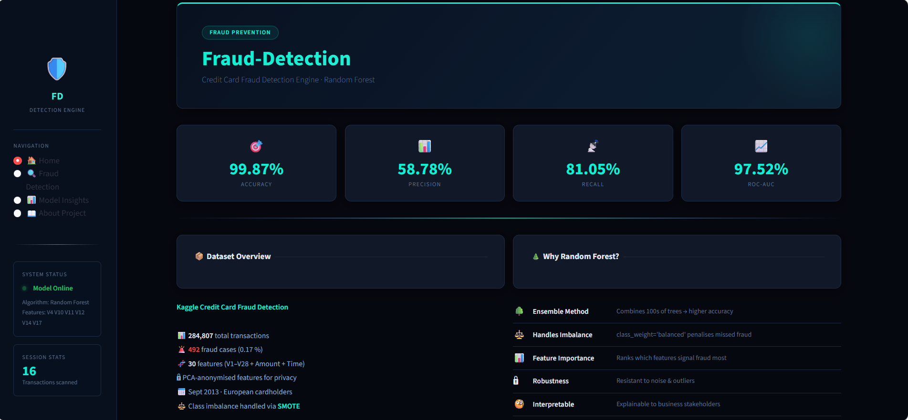
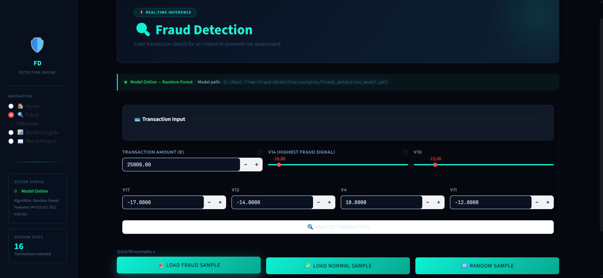
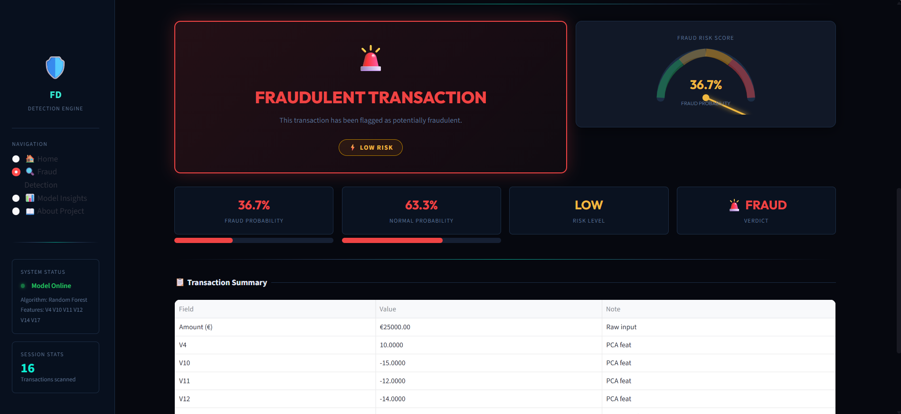
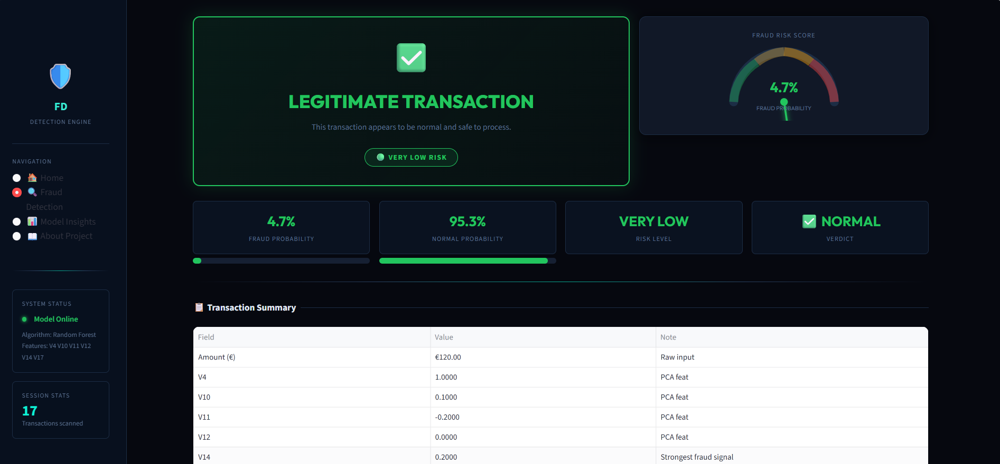
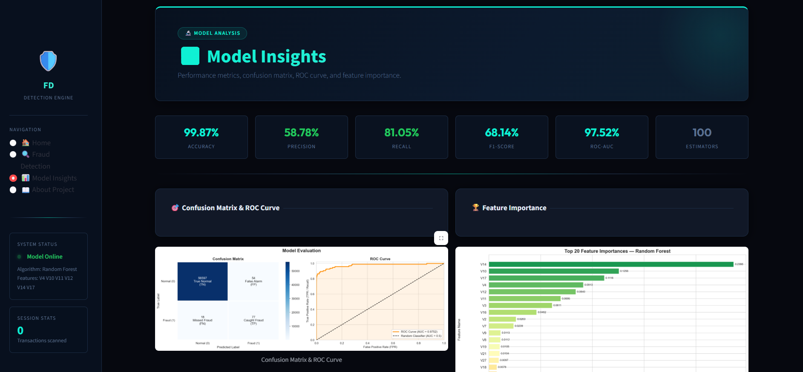
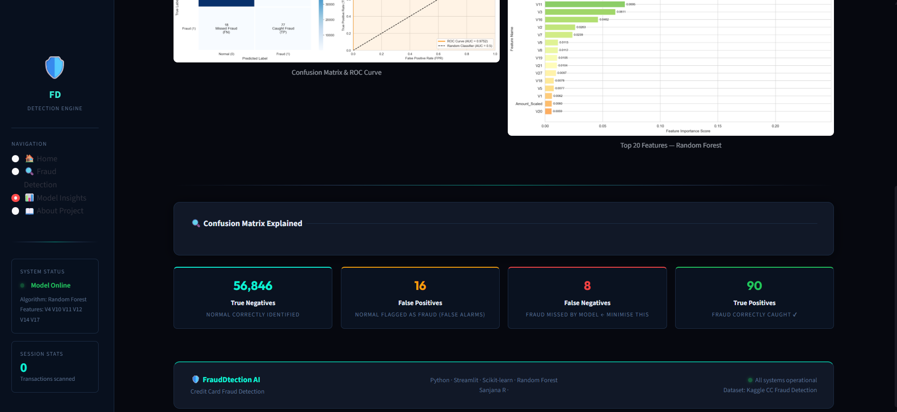

# 💳 Fraud Detection System using Machine Learning

A Credit Card Fraud Detection System built using **Machine Learning**, **Random Forest**, **SMOTE**, and an interactive **Streamlit Dashboard**.

---

# 📌 Project Overview

This project detects fraudulent credit card transactions using a **Random Forest Machine Learning model** trained on highly imbalanced transaction data.

The system includes:
- 🔄 End-to-end ML pipeline
- 🧹 Data preprocessing
- ⚖️ SMOTE balancing
- 📊 Model evaluation
- ⚡ Real-time prediction dashboard
- 🖥️ Interactive frontend using Streamlit

---

# ✨ Features

- ⚡ Real-time fraud prediction
- 🖥️ Interactive Streamlit frontend
- 📈 Fraud probability & risk score
- 🌲 Random Forest Machine Learning model
- ⚖️ SMOTE for class imbalance handling
- 📊 Model performance visualization
- 🎯 Confusion matrix & ROC curve
- 🔍 Feature importance analysis
- 🚨 Fraud/Normal quick sample testing

---

# 🛠️ Tech Stack

- 🐍 Python
- 🎈 Streamlit
- 🤖 Scikit-Learn
- 🐼 Pandas
- 🔢 NumPy
- 📊 Matplotlib
- 🎨 Seaborn
- ⚖️ Imbalanced-Learn
- 💾 Joblib

---

# 🧠 Machine Learning Workflow

1. 📂 Load Kaggle Credit Card Fraud dataset
2. 🧹 Perform preprocessing and EDA
3. ⚖️ Handle class imbalance using SMOTE
4. 🌲 Train Random Forest model
5. 📊 Evaluate performance metrics
6. 💾 Save trained model using Joblib
7. 🚀 Deploy frontend using Streamlit

---

# 📈 Model Performance

| Metric | Score |
|--------|--------|
| ✅ Accuracy | 99.87% |
| 🎯 Precision | 58.78% |
| 📡 Recall | 81.05% |
| 📊 F1-Score | 68.14% |
| 🚀 ROC-AUC | 97.52% |

---

# 📂 Project Structure

```bash
Fraud-Detection-System-using-Machine-Learning/
│
├── app.py
├── requirements.txt
├── README.md
├── .gitignore
│
├── notebook/
│   └── fraud_detection.ipynb
│
├── outputs/
│   ├── fraud_detection_model.pkl
│   └── scaler.pkl
│
├── graphs/
│   ├── confusion_matrix.png
│   ├── feature_importance.png
│   └── roc_curve.png
│
└── screenshots/
    ├── home_dashboard.png
    ├── fraud_transaction.png
    ├── fraud_transaction_op.png
    ├── normal_transaction.png
    ├── normal_transaction_op.png
    └── model_insight1.png
```

---

# 🖼️ Dashboard Screenshots

## 🏠 Home Dashboard



---

## 💳 Fraud Detection Interface



---

## 🚨 Fraudulent Transaction Prediction



---

## ✅ Legitimate Transaction Prediction



---

## 📊 Model Insights




---

# 📚 Dataset

### Dataset Used:
- Kaggle Credit Card Fraud Detection Dataset

### Dataset Characteristics:
- 📦 284,807 transactions
- ⚠️ Highly imbalanced dataset
- 🔐 PCA-transformed features (V1–V28)
- 💳 Includes Amount and Time features

---

# ⚙️ Installation & Setup

## 📥 Clone Repository

```bash
git clone https://github.com/your-username/Fraud-Detection-System-using-Machine-Learning.git
cd Fraud-Detection-System-using-Machine-Learning
```

---

## 📦 Install Dependencies

```bash
pip install -r requirements.txt
```

---

## ▶️ Run Streamlit Application

```bash
streamlit run app.py
```

---

# 🚀 Future Improvements

- 🔗 Flask/FastAPI deployment
- 🧠 SHAP explainability
- ⚙️ Hyperparameter tuning
- 🌐 Real-time transaction API
- 🐳 Docker deployment
- ☁️ Cloud deployment
- 📈 XGBoost/LightGBM comparison

---

# 🎓 Learning Outcomes

Through this project, I learned:
- 🔄 End-to-end ML workflow
- ⚖️ Handling imbalanced datasets
- 📊 Model evaluation techniques
- 🖥️ Frontend integration with ML
- 🎈 Streamlit dashboard development
- 🚀 Model deployment concepts

---

# 👩‍💻 Author

**Sanjana R**

Artificial Intelligence & Machine Learning Engineering Student

---
